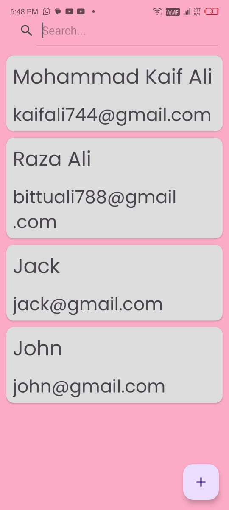
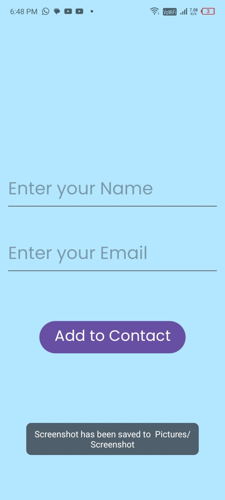

# Contact Manager App 📇

Contact Manager App is an Android project designed to practice using RoomDB, MVVM architecture, and DataBinding. The app allows users to add contacts with a name and email. Once a contact is saved, it is displayed on the main screen as a RecyclerView item and stored in RoomDB. The app also includes animations for RecyclerView items.

## Features
- **Main Screen:**
  - Displays a list of contacts using RecyclerView.
  - Contacts are stored in RoomDB for persistent storage.
  - Animations are applied to RecyclerView items for a smoother user experience.
  
- **Add Contact Screen:**
  - Users can add a new contact by entering a name and email.
  - On hitting the save button, the contact is added to the list and stored in RoomDB.

## Technologies Used
- Java
- Android Studio
- RoomDB
- MVVM (Model-View-ViewModel) Architecture
- DataBinding
- RecyclerView
- Animations

## Screenshots
- **Main Screen:**

  

- **Add Contact Screen:**

  

## How to Run
1. Clone the repository: `git clone https://github.com/kaifali744/ContactManagerApp.git`
2. Open in Android Studio
3. Build and run on an emulator or physical device

## Connect with Me
- [Twitter](https://x.com/kaifali744)
- [LinkedIn](https://www.linkedin.com/in/mohammad-kaif-ali-3a19671a0/)

